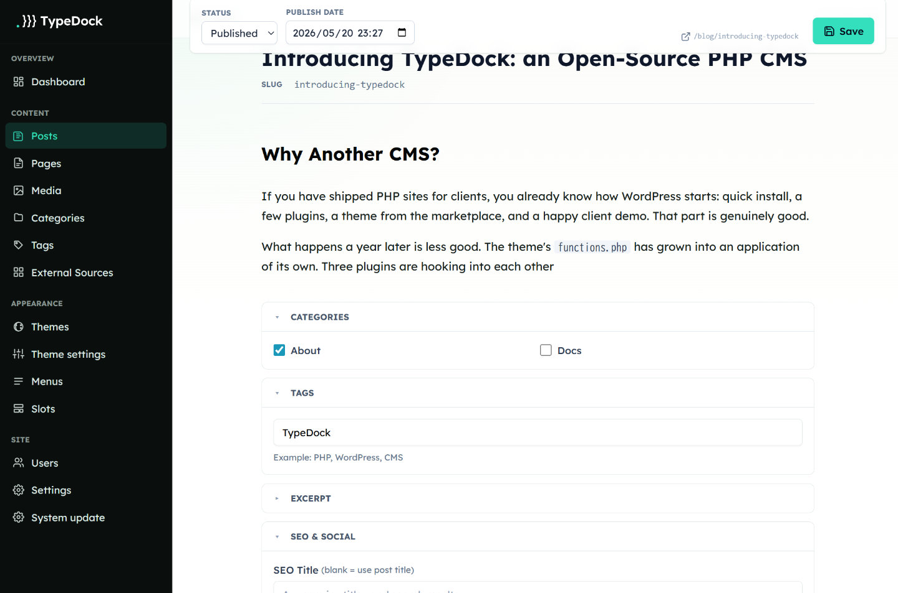

<div align="center">

# TypeDock

**A modern PHP CMS for sites that want WordPress-like deployment without WordPress-like trade-offs.**

[](https://www.php.net/)
[](LICENSE)
[]()

</div>



TypeDock is an open-source CMS for small teams, agencies, and self-hosted sites that still like PHP hosting but want cleaner boundaries than a typical WordPress build.

It keeps the familiar parts: uploadable releases, a browser installer, server-rendered pages, and a practical admin UI. It changes the parts that tend to age badly: themes cannot run arbitrary PHP, plugin routes and tables are scoped, content is stored as structured Tiptap JSON, and external sources can be mounted without turning the whole site into a frontend app.

> **Status:** Release candidate. TypeDock is ready for evaluation, theme/plugin experiments, and early dogfooding. Auth, content, media, SEO, search, theme rendering, the admin UI, the Tiptap 3 editor, drop-in plugins, External Source mode, and the shared-hosting package are working. CI runs PHPUnit across SQLite, MySQL 8, and PostgreSQL 14.

## Who It Is For

TypeDock is a good fit when you want:

- A CMS that installs on ordinary PHP hosting.
- A server-rendered site with a non-engineer-friendly admin area.
- Theme development that stays in templates, CSS, and JavaScript.
- Plugin extension points with tighter boundaries than a broad marketplace model.
- A small open-source core that is understandable enough to audit and maintain.

It is probably not the right fit yet if you need a mature plugin marketplace, complex enterprise workflows, or a production-critical system that cannot tolerate release-candidate software.

## Try TypeDock

### Public Demo

You can try the admin UI at [https://demo.typedock.dev/admin/login](https://demo.typedock.dev/admin/login).

```text
Email: demo@typedock.dev
Password: adminpass
```

The demo is periodically reset, so any content or settings you create there may be discarded.

### Option A: Docker Local Preview

```bash
make dev
make install
```

Open [http://localhost:8080](http://localhost:8080). The default Docker stack runs PHP-FPM behind nginx and uses SQLite on disk. MySQL and PostgreSQL profiles are available:

```bash
make dev-mysql
make dev-postgres
```

### Option B: Shared Hosting

Download `typedock-shared.zip` from a release and unzip it locally. The archive contains two folders:

```text
public_html/   -> upload these files into your webroot
typedock/      -> upload this as a sibling directory outside the webroot
```

Then:

1. Make `typedock/storage/` writable.
2. Open your site in a browser.
3. Complete the installer wizard with your database details and admin account.

The shared-hosting package ships compiled admin CSS and editor bundles. No Composer, Node.js, Tailwind, or build step is required on the host.

### Core Developer Workflow

```bash
make test              # PHPUnit
make assets            # Build admin CSS + editor bundle
make dist              # Build typedock-shared.zip
make security-scan     # OWASP ZAP passive baseline scan
```

## Why TypeDock

| Area | Typical WordPress trade-off | TypeDock direction |
| --- | --- | --- |
| Deployment | Easy upload, broad hosting support | Keep it: shared-hosting zip, browser installer, single `config.php` |
| Themes | Can run PHP and query the database | Latte templates + CSS + JS only, with auto-escaping by default |
| Plugins | Very flexible, broad supply-chain surface | Drop-in `plugins/<slug>/` with manifest, scoped routes/tables, iframe admin UI |
| Content body | HTML-heavy storage and editor coupling | Tiptap JSON stored in the DB, rendered server-side |
| Dynamic fragments | Shortcodes, widgets, blocks, template tags | `{component}` / `{slot}` plus declarative `theme.json` fetch |
| External content | Usually one-off plugin integrations | Built-in External Source system for read-only headless content |
| Structured content | Often postmeta/EAV patterns | External Source mounts read-only structured content without adding a local custom-field system |

TypeDock is intended as an **alternative**, not a replacement. It deliberately preserves the parts of WordPress that made deployment accessible, while taking a stricter stance on theme logic, plugin boundaries, and data shape.

## Features

- **Content editing** - Pages, Posts, Categories, Tags, Revisions, scheduling, trash/restore, translation groups, and author profiles.
- **Block editor** - Tiptap 3 with slash menu, floating toolbar, Media Picker, OGP bookmark cards, oEmbed support, component blocks, and a small Editor Public API for trusted plugins.
- **Auth and RBAC** - Session cookies, API keys, TOTP 2FA, login and 2FA brute-force lockout, 4 roles, named permissions, and ownership checks.
- **Themes** - Latte layouts, partials, component overrides, `theme.json` settings, custom components, and declarative fetch. Bundled themes: `default`, `kinari`.
- **Plugins** - Manifest-based drop-in plugins with optional iframe-isolated admin UI, zip upload installer, and `provides` collision detection.
- **Bundled plugins** - `form`, `redirect`, `social`, `image-optimizer`, `turnstile-captcha`, `advanced-blocks`, `backup`, `cloud-storage`, `source-contentful`, `source-github`, `source-github-docs`, and `simple-ai-writing`.
- **External Source** - Read-only content from Contentful, GitHub Issues, GitHub Docs, or generic JSON HTTP APIs. Credentials are encrypted at rest using `APP_KEY`.
- **SEO and feeds** - Meta tags, canonical URLs, Open Graph/Twitter metadata, sitemap, RSS, and search.
- **Multi-DB** - MySQL 8, PostgreSQL 14, and SQLite 3.35+ using the same migrations.
- **Security baseline** - CSP, X-Frame-Options, X-Content-Type-Options, Referrer/Permissions-Policy, HSTS on HTTPS, HttpOnly + SameSite session cookies, and OWASP ZAP tooling.

## Start Here

- [Theme development](docs/theme-development.md)
- [Theme template reference](docs/theme-template-reference.md)
- [API reference](docs/api.md)
- [Upgrade model](docs/upgrade.md)

## Project Layout

```text
typedock/
|-- public/        Entry point, installer, .htaccess, public assets
|-- src/           Core PHP code, services, controllers, middleware
|-- config/        App, database, cache, auth, mail, filesystem config
|-- migrations/    Driver-agnostic database migrations
|-- themes/        Bundled themes
|-- plugins/       Drop-in plugins
|-- admin/         Admin Latte templates and editor source
|-- cli/           install, migrate, cache-clear, export, import, seed
|-- docker/        nginx and OWASP ZAP compose-side config
`-- storage/       Cache, logs, sessions, uploads, backups
```

## Configuration

TypeDock reads a single `config.php` at the project root, similar in spirit to `wp-config.php`. Environment variables override `config.php`, so the same project can run on shared hosting, Docker, or a PaaS-style environment.

## Plugins

Plugins live under `plugins/<slug>/` and declare a `plugin.json` manifest. They run as trusted PHP, but TypeDock enforces structural boundaries:

- Public routes are scoped under `/plugin/{slug}/*`.
- Admin routes are scoped under `/admin/plugins/{slug}/*`.
- Plugin database tables use the `plugin_{slug}_*` prefix.
- `provides` claims detect provider collisions before one plugin silently replaces another.
- Plugin admin UIs render inside an iframe so their CSS and JavaScript do not leak into the core admin.

## CLI

```bash
php cli/install.php         # Interactive install
php cli/migrate.php         # Apply DB migrations
php cli/cache-clear.php     # Clear template + HTML cache
php cli/export.php          # Export content to JSON
php cli/import.php          # Import a previous export
php cli/assets-publish.php  # Copy theme/plugin assets into public/
php cli/upgrade.php         # Upgrade preflight + agent handoff context
php cli/seed.php            # Insert demo content
```

## Useful Feedback Right Now

The most helpful release-candidate feedback is concrete installation and authoring feedback:

- Did the shared-hosting installer work on your host?
- Which PHP extensions or permissions were missing?
- Did SQLite, MySQL, or PostgreSQL setup behave as expected?
- Was theme development clear from `theme.json` and Latte docs?
- Did plugin boundaries feel too constrained, or not constrained enough?
- Did the editor feel comfortable for real article/page writing?

## Tech Stack

PHP 8.2+ / [FlightPHP](https://flightphp.com/) 3.17+ / [Latte](https://latte.nette.org/) 3.1+ / [Ramsey UUID](https://uuid.ramsey.dev/) v7 / [Tiptap](https://tiptap.dev/) 3 / [PHPMailer](https://github.com/PHPMailer/PHPMailer) / MySQL 8+ / PostgreSQL 14+ / SQLite 3.35+

## Contributing

Open an issue first for changes that touch the data model, theme API, component contract, authentication, or plugin boundaries.

Please keep these constraints intact:

- Themes do not run PHP or query the database.
- Multi-DB compatibility matters: avoid database-specific shortcuts in migrations.
- Dynamic rendering goes through components, slots, fetch definitions, or injected services.
- Admin UI changes should preserve the semantic CSS contract used by core and bundled plugins.

## Roadmap

- [x] Drop-in plugin architecture, Tiptap 3 editor, security baseline, External Source mode, Docker stack, multi-DB CI
- [ ] Pluggable search drivers
- [ ] WordPress export/import path for migration projects
- [ ] Split bundled plugins into separate official repositories
- [ ] Public plugin/theme registry
- [ ] Official production Docker image

## License

Apache License 2.0. See [LICENSE](LICENSE) and [NOTICE](NOTICE).

## Acknowledgements

Design informed by [Cloudflare EmDash](https://github.com/cloudflare/emdash), [Statamic](https://statamic.com/), [Kirby](https://getkirby.com/), [Craft](https://craftcms.com/), [Notion](https://www.notion.so/), and twenty years of WordPress's deployment model that TypeDock deliberately preserves.
